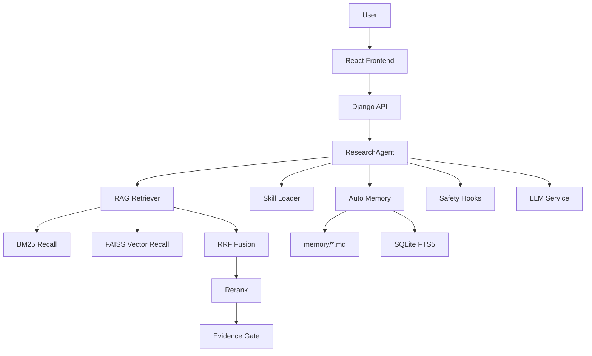

# PicAgent

PicAgent 是一个面向科研场景的 LLM Agent 项目，支持论文检索、论文阅读、创新点分析、模型图生成和文档上下文问答。项目不是简单的聊天机器人，而是在 Agent 执行链路中加入意图识别、Skill 路由、RAG 证据门控、长期记忆、上下文压缩、安全 Hook 和量化评估，提升科研问答的可靠性与可控性。

## 核心亮点

- **科研 Agent 链路**：支持意图识别、Skill 路由、动态 Prompt 加载和 Plan-to-Solve 任务拆解，复杂任务可自动规划检索、对比、总结和报告生成步骤。
- **RAG 防幻觉机制**：融合 BM25、向量检索、Rerank、证据覆盖校验和拒答策略，证据不足时触发补充检索或明确拒答。
- **跨对话长期记忆**：基于 `memory/MEMORY.md`、多主题 Markdown、SQLite FTS5 和 LLM 摘要实现长期记忆记录、检索和按需注入。
- **三层上下文管理**：支持 200K 上下文窗口、最近 3 轮完整保留、历史摘要压缩、工具返回关键片段提取和极限场景 context reset。
- **论文库向量检索**：基于 MySQL 论文文本生成 BGE-M3 语义向量，并构建 FAISS IVF 聚类索引，支持小批量增量更新和大批量重训。
- **安全 Hook 机制**：在用户输入、计划生成、RAG 检索、生成前后执行安全校验，拦截危险请求、无证据生成和敏感信息泄露。
- **量化测试体系**：提供 Recall、MRR、幻觉率、证据覆盖等测试模块，支持 `pytest` 自动验证。

## 技术栈

| 模块 | 技术 |
| --- | --- |
| 前端 | React, Vite, Axios |
| 后端 | Django, Django REST Framework |
| Agent | Python, ResearchAgent, Skill Loader, Hook Pipeline |
| RAG | BM25, FAISS IVF, BGE-M3, RRF, Reranker |
| 记忆 | Markdown, SQLite FTS5, LLM Summary |
| 数据库 | MySQL |
| 测试 | pytest |

## 系统架构



## 目录结构

```text
backend/                 Django 后端服务
frontend/                React 前端界面
figure_agent/agent/      Agent 调度、记忆、Hook、安全机制
figure_agent/rag/        RAG 检索、Embedding、Reranker、评估
Skill/                   论文检索、阅读、创新点分析、模型图生成技能
PaperLibrary/            示例论文库数据
tests/                   自动化测试
memory/                  本地长期记忆目录，真实数据不提交
models_cache/            本地 FAISS / 模型缓存，不提交
models/                  本地模型权重，不提交
```

## 快速开始

### 1. 克隆项目

```bash
git clone https://github.com/newobject666/picagent.git
cd picagent
```

### 2. 配置环境变量

复制 `.env.example`，并按本地环境填写：

```bash
cp .env.example .env
```

需要重点配置：

```text
DASHSCOPE_API_KEY=你的模型服务 API Key
MYSQL_DATABASE=picagent
MYSQL_USER=root
MYSQL_PASSWORD=你的 MySQL 密码
MYSQL_HOST=127.0.0.1
MYSQL_PORT=3306
```

### 3. 启动后端

```bash
python backend/manage.py migrate
python backend/manage.py runserver 0.0.0.0:8000
```

### 4. 启动前端

```bash
cd frontend
npm install
npm run dev
```

默认访问：

```text
http://127.0.0.1:5173/
```

如果端口被占用，Vite 会自动提示新的本地访问地址。

## 论文库与向量索引

项目中 MySQL 保存论文文本和元数据，FAISS 只作为可重建的向量索引层：

```text
MySQL: title / authors / year / abstract / metadata
FAISS: BGE-M3 embedding vector index
```

小批量新增论文时，系统执行去重、向量化并归入最近聚类中心；当新增数量超过阈值时，会重新训练 FAISS IVF 聚类索引，以提升大规模论文库检索速度。

本地模型权重和索引文件默认不提交到 GitHub，需要在本机重新生成或下载。

## RAG 防幻觉流程

```text
用户问题
-> 意图识别
-> BM25 + 向量混合召回
-> RRF 融合排序
-> Rerank 精排
-> 相关性三信号评估
-> 问题拆解与证据覆盖校验
-> PASS / RETRY / REFUSE
-> 证据约束生成
```

相关性判断综合：

- Embedding 相似度
- Reranker 分数
- 关键词命中

证据覆盖校验会把用户问题拆成多个子需求，逐项判断是否有证据支撑。证据不足时，系统不会让模型硬编，而是触发补充检索或明确说明资料不足。

## 长期记忆

Auto Memory 使用文件系统保存长期记忆：

```text
memory/
  MEMORY.md
  <topic>_note_*.md
  memory_fts.sqlite3
```

实现机制：

- 每轮会话结束后自动判断是否值得记忆。
- 使用 LLM 生成不超过 150 字符的摘要。
- 将记忆写入多主题 Markdown 文件。
- 使用 SQLite FTS5 建立全文检索索引。
- 新增、删除、合并记忆时执行增量 FTS 更新。
- 新会话中根据当前问题检索相关历史记忆并注入上下文。

## 文档上传

前端支持上传文档作为本轮上下文，后端解析后注入 Agent：

- `.txt`
- `.md`
- `.docx`
- `.pdf`

上传文档只作为当前任务上下文使用，不会因为普通用户问题自动触发后台论文爬虫或论文库写入。

## 测试

运行完整测试：

```bash
python -m pytest tests
```

当前测试覆盖：

- Agent 路由与 Plan-to-Solve
- RAG 召回率、MRR 和幻觉率评估
- 证据覆盖与拒答机制
- Auto Memory 与 FTS5 检索
- FAISS 向量索引与论文更新策略
- 文档解析和上传上下文
- 安全 Hook 策略

最近一次验证结果：

```text
47 passed
```

## 评估指标

项目内置 RAG 质量评估模块，支持对比改造前后的检索质量：

| 指标 | 改造前 | 改造后 |
| --- | ---: | ---: |
| Recall@4 | 41.67% | 91.50% |
| MRR | 62.86% | 90.23% |

## 注意事项

- `models/`、`models_cache/`、`memory/` 中的真实运行数据不会提交到 GitHub。
- `.env` 不会提交，请使用 `.env.example` 创建本地配置。
- BGE-M3、Reranker 和 FAISS 索引需要在本地环境准备或重新生成。
- MySQL 中保存的是论文文本和元数据，向量索引是可重建的加速层。

