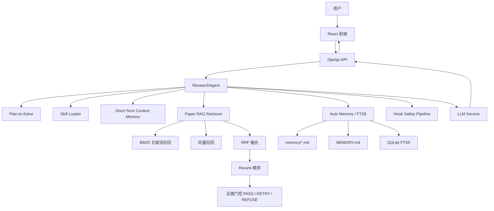

# Research Agent 技术文档

## 项目简介

Research Agent 是一个面向科研问答与论文知识库分析的智能 Agent 项目。系统围绕“可靠回答、可追溯证据、跨会话记忆、安全执行”设计，集成前端交互、Django 后端、RAG 检索增强、长期记忆、上下文压缩、Hook 安全机制与自动化测试评估。

项目不是简单调用大模型生成回答，而是在 Agent 执行链路中加入计划制定、工具调度、证据检索、证据覆盖校验、拒答机制、长期记忆召回和生成后校验，降低 RAG 幻觉并提升回答可控性。

## 项目亮点

- **RAG 防幻觉策略**：实现 `BM25 + FAISS 向量库 + Rerank + 拒答机制`，结合证据门控避免模型无依据生成。
- **三信号相关性判断**：使用 `Embedding 相似度 + Reranker 分数 + 关键词命中` 综合判断 chunk 是否真正相关。
- **证据覆盖校验**：将用户问题拆解为多个子需求，逐项验证证据是否覆盖，证据不足时触发补充检索或拒答。
- **证据约束生成**：Prompt 层强制模型只基于证据回答，缺失信息必须输出“资料中未提到”。
- **跨对话长期记忆**：基于 `memory/MEMORY.md + 多主题 Markdown + SQLite FTS5` 构建 Auto Memory，支持数周后自动召回历史对话细节。
- **200K 上下文管理**：实现最近 3 轮完整保留、旧对话摘要压缩、大工具结果摘取和 context reset。
- **Hook 安全机制**：在用户输入、计划生成、RAG 前后、生成前后加入安全拦截点，阻断危险请求和无证据生成。
- **量化评估体系**：提供召回率、MRR、幻觉率测试模块，支持 pytest 自动验证。

## 技术栈

| 层级 | 技术 |
| --- | --- |
| 前端 | React, Vite, Axios |
| 后端 | Django, Django REST Framework |
| Agent 核心 | Python, 自研 ResearchAgent 调度 |
| RAG | BM25, FAISS 向量库, RRF 融合, BGE-M3 Embedding, BGE Reranker |
| 记忆系统 | Markdown 持久化, SQLite FTS5, LLM 摘要 |
| 安全机制 | Hook Pipeline, Safety Policy |
| 测试 | pytest, 自研 RAG Accuracy Tester |

## 系统架构



## Agent 执行流程

1. 接收用户问题。
2. 执行 Hook 安全检查。
3. 生成 `Plan-to-Solve`，明确本轮执行步骤。
4. 按需加载 Skill、长期记忆和 RAG 证据。
5. 如果触发 RAG，执行意图识别、混合召回、融合重排、证据覆盖校验。
6. 生成前再次检查证据是否足够。
7. 调用 LLM 生成答案。
8. 生成后执行 Hook 校验。
9. 写入短期上下文，并自动记录到长期记忆。

## RAG 防幻觉设计

### 检索链路

RAG 检索链路采用多阶段策略：

```text
用户问题
→ 意图识别
→ 决定检索范围和策略
→ BM25 召回
→ FAISS 向量库召回
→ RRF 融合排序
→ Rerank 精排
→ 三信号相关性评估
→ 证据覆盖校验
→ PASS / RETRY / REFUSE
```

### 三信号相关性评估

系统不只看候选 chunk 是否“看起来相似”，而是综合三个信号：

```text
综合相关性 = Embedding 相似度 * 0.38
          + Reranker 分数 * 0.42
          + 关键词命中分 * 0.20
```

当 Reranker 不可用时降级为：

```text
综合相关性 = Embedding 相似度 * 0.60
          + 关键词命中分 * 0.40
```

三类信号的作用：

- **Embedding 相似度**：判断 query 和 chunk 的语义接近程度。
- **Reranker 分数**：判断 chunk 是否真的能回答 query。
- **关键词命中**：保证关键实体、术语、指标不会被语义召回忽略。

### MySQL 与 FAISS 的数据分工

论文库写入 MySQL 时保存的是可读文本和元数据：

```text
paper_record:
- title
- keywords
- year
- summary
- source
```

FAISS 不作为主数据源，只作为可重建的向量索引层：

```text
models_cache/faiss/
- paper_vectors.index       # FAISS 向量索引
- paper_vectors.meta.json   # paper_id/title 映射和模型信息
```

同步流程：

```text
上传 papers.json
→ 写入 MySQL paper_record 文本数据
→ Agent 从 MySQL reload 论文
→ 使用 BGE-M3 或 hash fallback 生成 dense embedding
→ 重建 FAISS 向量索引
→ 查询时 BM25 与 FAISS 结果做 RRF 融合
```

### 证据覆盖校验

相关 chunk 不等于证据充分。系统会进一步把用户问题拆解为多个小需求：

```text
问题：Kafka 消息堆积时如何处理并保证消息不丢？

需求拆解：
- Kafka 消息堆积处理
- 消息可靠性保证
- 消息不丢机制
```

随后逐项判断是否存在证据支持：

```text
{
  "Kafka 消息堆积处理": true,
  "消息可靠性保证": false,
  "消息不丢机制": false
}
```

如果证据不足，系统不会让模型硬编：

- `PASS`：证据充分，可以回答。
- `RETRY`：证据部分缺失，触发补充检索。
- `REFUSE`：多次检索后仍不足，明确说明资料不足。

### 证据约束生成

生成阶段注入证据约束规则：

- 只能基于给定证据回答。
- 证据中没有明确提到的信息不能补充。
- 每个关键结论必须标注来源。
- 某个问题点没有证据支持时，必须说明“资料中未提到”。

## Auto Memory 跨对话记忆

项目实现了文件化长期记忆系统，解决 Agent 在长周期使用中无法记住历史对话的问题。

目录结构：

```text
memory/
  MEMORY.md
  rag_note_*.md
  memory_note_*.md
  safety_note_*.md
  testing_note_*.md
  memory_fts.sqlite3
```

核心能力：

- 每轮 Agent 会话结束后自动判断是否值得记忆。
- 使用 LLM 生成 150 字以内摘要，失败时本地摘要兜底。
- 将记忆写入多主题 Markdown 文件。
- `MEMORY.md` 作为索引，最多保留 200 行。
- 使用 SQLite FTS5 建立全文检索索引。
- 新会话中根据当前问题自动检索历史记忆并注入上下文。
- 高度重叠的记忆碎片会被合并成一个概括性文件，旧文件和旧索引行会被删除。

跨对话召回流程：

```text
新问题
→ AutoMemoryStore.search(query)
→ SQLite FTS5 检索历史摘要、主题、正文、ngram terms
→ 返回相关记忆摘要和命中片段
→ 作为 system message 注入 Agent 上下文
→ LLM 基于当前问题和历史记忆回答
```

## 上下文管理

短期上下文采用 200K 窗口三层策略：

1. **常规保留**
   - system prompt 不压缩。
   - 最近 3 轮完整对话保留。
   - 工具返回结果如果过大，只保留关键片段。

2. **自动压缩**
   - 接近上下文上限时，早期对话压缩成摘要。
   - 大工具结果进一步裁剪。
   - 子 Agent 结果只保留摘要。

3. **Context Reset**
   - 压缩仍不足时，丢弃旧上下文窗口。
   - 状态外化到文件系统和数据库，新窗口通过文件恢复进度。

## Hook 安全机制

系统在 Agent 生命周期中加入多个安全检查点：

```text
USER_INPUT
PLAN_CREATED
BEFORE_RAG
AFTER_RAG
BEFORE_GENERATION
AFTER_GENERATION
```

Safety Policy 能够拦截：

- 危险系统命令。
- 绕过权限或认证的请求。
- 恶意代码、密钥窃取、破坏性操作。
- RAG 证据不足时的强行生成。
- 生成结果中疑似泄露密钥或敏感信息的内容。

## 前后端能力

### 前端

- React + Vite 构建聊天界面。
- 支持用户与 Agent 多轮交互。
- 支持上传论文库文件，更新本地 RAG 语料。

### 后端

- Django REST Framework 提供接口。
- 管理聊天 session、消息记录、长期记忆、论文记录。
- AgentManager 按 session 维护 ResearchAgent 实例。
- 上传论文数据后同步 MySQL 和 RAG 检索器。

## 测试与量化指标

项目内置测试覆盖：

- Hook 安全策略。
- Auto Memory 写入、摘要、FTS5 跨会话检索。
- 200K 上下文管理。
- RAG 准确性检测。
- RAG 召回率、MRR、幻觉率评估。

运行测试：

```bash
python -m pytest tests
```

当前测试结果：

```text
19 passed
```

RAG 质量指标：

| 指标 | 改造前 | 改造后 |
| --- | ---: | ---: |
| Recall@2 | 41.67% | 100.00% |
| MRR@2 | 41.67% | 100.00% |
| Recall@4 | 75.00% | 100.00% |
| MRR@4 | 47.22% | 100.00% |
| 幻觉率 | 42.86% | 0.00% |

## 目录说明

```text
backend/                 Django 后端服务
frontend/                React 前端
figure_agent/agent/      Agent 调度、记忆、Hook、安全机制
figure_agent/rag/        RAG 检索、Embedding、Reranker、准确性测试
memory/                  Auto Memory 长期记忆目录
PaperLibrary/            本地论文库数据
Skill/                   Agent 技能说明
tests/                   自动化测试
```

## 核心文件

| 文件 | 作用 |
| --- | --- |
| `figure_agent/agent/research_agent.py` | Agent 主调度，负责计划、RAG、记忆、生成和 Hook |
| `figure_agent/rag/paper_retriever.py` | RAG 检索、防幻觉、证据门控核心实现 |
| `figure_agent/rag/accuracy_tester.py` | 回答准确性与幻觉率检测 |
| `figure_agent/agent/auto_memory.py` | FTS5 跨对话长期记忆 |
| `figure_agent/agent/memory.py` | 200K 短期上下文管理 |
| `figure_agent/agent/hooks.py` | Hook 安全策略 |
| `tests/test_rag_metrics.py` | Recall、MRR、幻觉率量化评估 |
| `tests/test_auto_memory.py` | Auto Memory 与 FTS5 跨会话检索测试 |

## 项目价值

本项目重点解决普通 LLM Agent 的三个常见问题：

1. **容易幻觉**：通过证据门控、覆盖校验、拒答机制降低无证据回答。
2. **记不住历史**：通过 Auto Memory + FTS5 实现跨会话长期记忆。
3. **执行不可控**：通过 Plan-to-Solve 和 Hook Pipeline 提升执行可解释性和安全性。

## 简历式总结

设计并实现科研问答 Agent 系统，集成 `BM25 + FAISS 向量库 + Rerank + 拒答机制` 的 RAG 防幻觉链路，引入三信号 relevance gate 与证据覆盖校验，将 Recall@2 从 41.67% 提升至 100%，幻觉率从 42.86% 降至 0%；同时实现基于 Markdown + SQLite FTS5 + LLM 摘要的跨对话长期记忆，以及 200K 上下文压缩和 Hook 安全机制，并通过 pytest 建立可重复量化评估体系。
